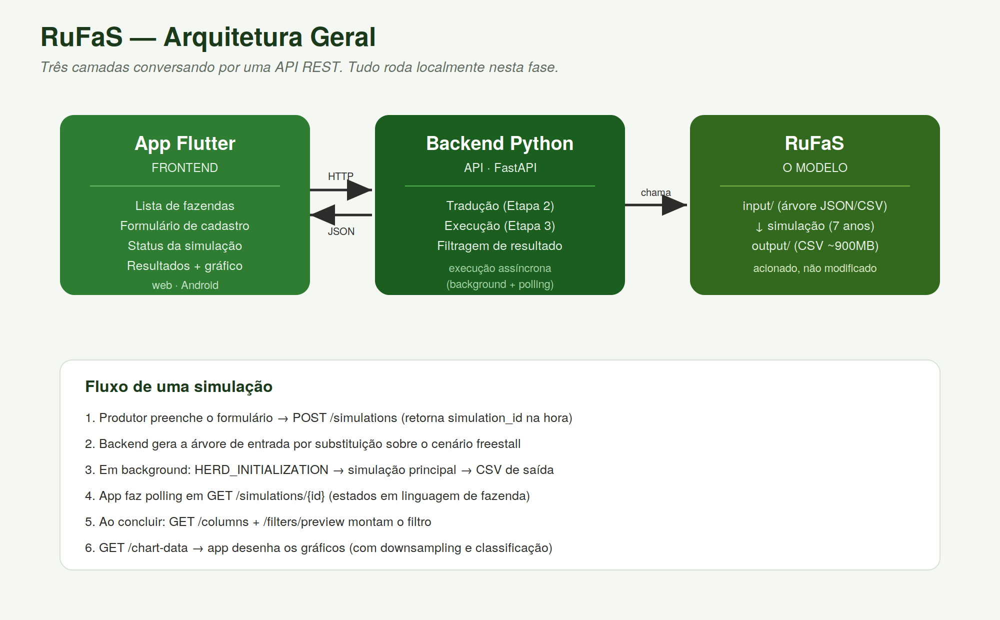

# RuFaS — Interface do Produtor

Interface amigável que conecta produtores rurais ao modelo de simulação de fazenda leiteira **RuFaS** (Ruminant Farm Systems), escondendo a complexidade técnica do modelo por trás de um formulário em linguagem de fazenda, um backend que executa a simulação, e um aplicativo que explora os resultados.

> **Estado atual:** app funcional de ponta a ponta (cadastro em wizard → simulação → filtragem → visualização), em web e Android, com menu lateral e identidade visual própria (paleta editorial de laticínio, tipografia Work Sans). Roda localmente. Ver [Roadmap](#roadmap) para o que falta.

---

## O problema

O RuFaS é um modelo científico poderoso (whole-farm, process-based, open-source), mas sua interface atual é inacessível para quem não é programador:

- **Entrada:** uma árvore de arquivos JSON/CSV encadeados, minificados, editados à mão ou por linha de comando.
- **Saída:** um CSV de ~3.322 colunas e até ~900 MB que o Excel não abre.

Isso exclui justamente quem mais se beneficiaria do modelo — o produtor, o zootecnista de campo, o extensionista. **Este projeto é a ponte** entre a profundidade do modelo e esses usuários.

## A solução

Uma interface em cinco etapas. O usuário responde poucas perguntas em linguagem de fazenda; o sistema faz o resto nos bastidores.

| Etapa | O que faz | Estado |
|-------|-----------|--------|
| 1. Entrada do produtor | Formulário em linguagem de fazenda | ✅ Implementado (app) |
| 2. Tradução | Converte respostas na árvore de arquivos do RuFaS | ✅ Implementado (backend) |
| 3. Execução | Roda o RuFaS nos bastidores | ✅ Implementado (backend) |
| 4. Resultados | Filtra e visualiza a saída da simulação | ✅ Implementado (app + backend) |
| 5. Assistente | Consulta em linguagem natural sobre os resultados | ⬜ A construir (Fase 4) |

## Arquitetura em resumo



Três camadas conversando por uma API REST:

```
Produtor → [App Flutter] → HTTP/REST → [Backend Python/FastAPI] → [RuFaS] → resultado
   (web, Android)                        (tradução + execução + filtragem)
```

- **Frontend:** app Flutter (web, Android; macOS/iOS pendentes) — as 4 telas do fluxo.
- **Backend:** API FastAPI em Python que traduz os dados, executa o RuFaS e serve os resultados filtrados.
- **Modelo:** o RuFaS, acionado pelo backend.

Detalhes em [`docs/ARCHITECTURE.md`](docs/ARCHITECTURE.md).

## Estrutura do repositório

```
projetoRuFaS/
├── RuFaS/               # o modelo — git submodule (github.com/RuminantFarmSystems/RuFaS)
├── backend/             # API FastAPI (tradução, execução, filtragem)
├── flutter_app/         # aplicativo Flutter (frontend)
├── dashboard/           # dashboard Streamlit original (marco anterior)
├── hf-space/             # deploy do dashboard no Hugging Face Spaces (repo git próprio)
├── docs/                # documentação técnica
│   ├── ARCHITECTURE.md
│   ├── REQUIREMENTS.md
│   └── FEATURES.md
├── notas/                # anotações técnicas avulsas (ex. análise de redução de CSV)
├── CLAUDE.md            # memória de contexto do projeto
└── README.md
```

## Como rodar (desenvolvimento local)

> **Pré-requisitos:** Python 3.x com o venv do RuFaS, Flutter 3.44+, e o RuFaS já funcional na máquina. Como `RuFaS/` é um git submodule, um clone novo precisa de `git submodule update --init` (ou clonar com `--recurse-submodules`) antes de tudo.

### Backend

O backend importa a si mesmo como pacote (`from backend import ...`), então precisa rodar **a partir da raiz do projeto**, com a raiz no `PYTHONPATH`:

```bash
source RuFaS/venv/bin/activate       # o venv do RuFaS, onde fastapi/uvicorn foram instalados
PYTHONPATH=. uvicorn backend.app:app --reload --port 8000
```
A API sobe em `http://localhost:8000`. Documentação interativa automática em `http://localhost:8000/docs` (Swagger, gerado pelo FastAPI).

> **Nota técnica:** o venv do RuFaS tem um `pip install` não-editável incompleto (falta o subpacote `RUFAS.biophysical`, por uma limitação do `pyproject.toml` do RuFaS). `backend/simulation_runner.py` já contorna isso sozinho, inserindo o código-fonte real (`RuFaS/RUFAS/`) na frente no `sys.path` antes de importar — não é mais preciso incluir `RuFaS` manualmente no `PYTHONPATH` do comando acima.

### Frontend (Flutter)

```bash
cd flutter_app
flutter pub get
flutter run -d chrome                # web
# ou
flutter run -d <emulador_android>    # Android
```

> **Nota de rede:** o app resolve a URL da API por plataforma automaticamente — `localhost:8000` na web, `10.0.2.2:8000` no emulador Android (o emulador não enxerga `localhost` como o host). Ver `flutter_app/lib/core/api_client.dart`.

## Endpoints da API (resumo)

| Método | Rota | Função |
|--------|------|--------|
| `POST` | `/simulations` | Recebe os dados de uma fazenda, dispara a simulação (assíncrona), retorna `simulation_id` |
| `GET`  | `/simulations` | Lista as simulações |
| `GET`  | `/simulations/{id}` | Status de uma simulação (para polling) |
| `GET`  | `/simulations/{id}/result` | Metadados do resultado |
| `GET`  | `/simulations/{id}/download` | Baixa o CSV completo |
| `GET`  | `/simulations/{id}/columns` | Colunas, módulos e palavras-chave disponíveis |
| `POST` | `/simulations/{id}/filters/preview` | Aplica filtro (sem carregar dados), retorna contagem de colunas |
| `GET`  | `/simulations/{id}/chart-data` | Séries prontas para plotar, com classificação e downsampling |

Detalhes de cada um em [`docs/FEATURES.md`](docs/FEATURES.md).

## Limitações conhecidas

- **Uma simulação por vez** (fila serializada) — concorrência real não implementada.
- **Gap do curral:** a capacidade dos currais não escala automaticamente com o número de animais; rebanhos grandes podem superlotar.
- **Separador de esterco trava a simulação em rebanhos grandes:** um parâmetro fixo do cenário original (`separated_solids_dry_matter`) não escala com `cow_num` — simulações acima de ~120 vacas falham sem gerar CSV (`ValueError` no separador `screw_press_1`). Faixa validada: até ~120 vacas.
- **Sem limpeza automática:** cada simulação gera ~1 GB; a limpeza de execuções antigas é manual (prioridade para robustez futura).
- **`annual_milk_yield` é alvo, não garantia:** a produção informada calibra a curva de lactação; o valor realizado depende da dinâmica completa da simulação.
- **macOS/iOS não validados:** requer instalação completa do Xcode.
- **Roda apenas localmente:** sem deploy/hospedagem nesta fase.

## Roadmap

- **Fase 4 — Assistente conversacional:** consulta aos resultados em linguagem natural (LLM).
- **Aplicar design refinado** e validar em macOS/iOS.
- **Robustez para uso real:** limpeza automática de arquivos, tratamento do gap do curral, concorrência.
- **Deploy:** quando a solução amadurecer (fora do escopo local atual).

## Contexto e memória

O arquivo [`CLAUDE.md`](CLAUDE.md) na raiz mantém o histórico de decisões, achados técnicos e o estado do projeto — leitura recomendada antes de contribuir.

## Licença

**[definir]** — herda ou referencia a licença do RuFaS conforme aplicável.
