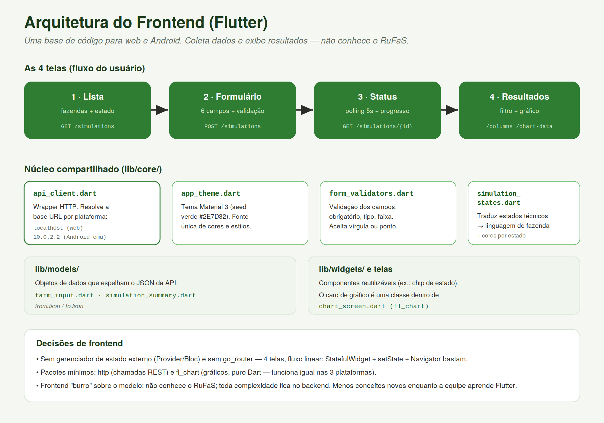
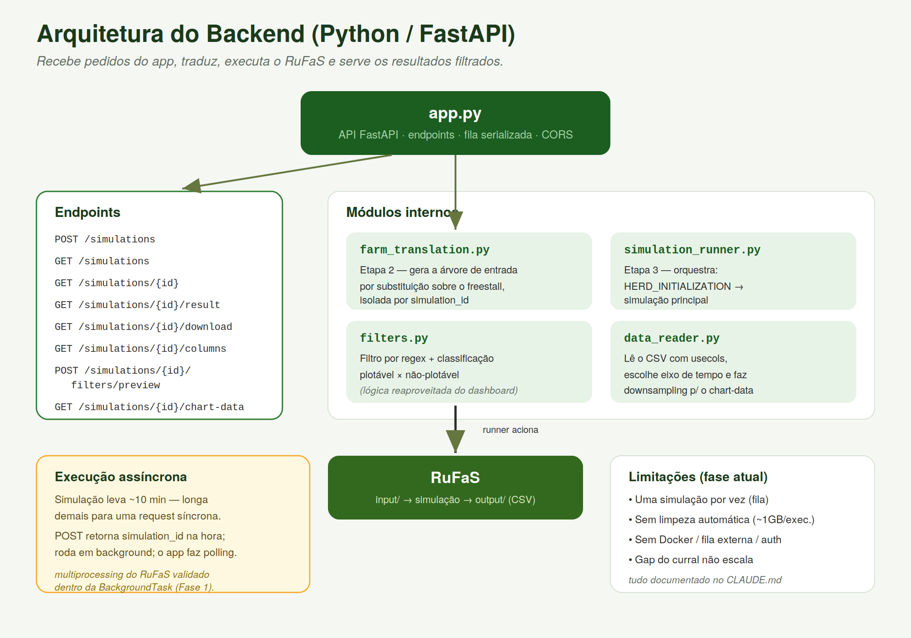

# Arquitetura — RuFaS Interface do Produtor

Este documento descreve o design arquitetural do sistema: as camadas, como se comunicam, as decisões técnicas e seus porquês.

## Visão geral


O sistema tem três camadas, separadas por responsabilidade e conectadas por uma API REST:

```
┌─────────────────────┐     HTTP/REST      ┌──────────────────────────┐
│   App Flutter       │ ◄────────────────► │   Backend Python         │
│   (frontend)        │      JSON          │   (FastAPI)              │
│                     │                    │                          │
│ - Lista de fazendas │                    │ - Tradução               │
│ - Formulário        │                    │ - Execução do RuFaS      │
│ - Status            │                    │ - Filtragem de resultado │
│ - Resultados/gráfico│                    │                          │
│ web · Android       │                    └───────────┬──────────────┘
└─────────────────────┘                                │ chama
                                                        ▼
                                            ┌──────────────────────────┐
                                            │   RuFaS (o modelo)       │
                                            │   input/ → simulação →   │
                                            │   output/ (CSV)          │
                                            └──────────────────────────┘
```

**Princípio central:** o frontend não sabe nada sobre o RuFaS. Ele apenas coleta dados do produtor e exibe o que a API devolve. Toda a complexidade do modelo (árvore de arquivos, execução, formato do CSV) fica encapsulada no backend.

## Camada 1 — Frontend (Flutter)



### Por que Flutter
Uma única base de código gera o app para web, Android e (futuramente) iOS/macOS. Como o objetivo é alcançar produtores (celular) e também permitir uso no navegador, o multiplataforma de código único é decisivo.

### Organização
```
flutter_app/lib/
├── main.dart               # entrada; aplica o tema
├── core/
│   ├── api_client.dart     # wrapper HTTP; resolve base URL por plataforma
│   ├── app_theme.dart      # tema Material 3 (fonte única de cores/estilos)
│   ├── form_validators.dart# validação dos campos do formulário
│   └── simulation_states.dart # tradução dos estados técnicos → linguagem de fazenda
├── models/                 # farm_input, simulation_summary
├── screens/                # as 4 telas do fluxo (results_screen.dart + chart_screen.dart formam a Tela 4, em duas partes)
└── widgets/                # componentes reutilizáveis (hoje: chip de estado — o card de gráfico é uma classe privada dentro de chart_screen.dart, não um widget à parte)
```

### Decisões de frontend
- **Sem gerenciador de estado externo** (Provider/Riverpod/Bloc) nesta fase: com 4 telas e fluxo linear, `StatefulWidget` + `setState` + `Navigator` do Flutter bastam. Menos conceitos novos enquanto a equipe aprende Flutter. Reavaliar se a Fase 4 (chat) crescer a complexidade.
- **`http` em vez de `dio`:** o pacote oficial cobre as necessidades atuais; recursos avançados (interceptors, retry) não são necessários ainda.
- **`fl_chart` para gráficos:** puro Dart, sem dependência nativa — funciona igual nas três plataformas.
- **Material 3 via seed color:** o tema deriva toda a paleta de uma cor-semente (verde `#2E7D32`), gerando variações harmônicas automaticamente. Centralizado em `app_theme.dart`.

### Resolução de rede por plataforma
Ponto de atenção específico do Flutter, centralizado em `api_client.dart`:
- **Web / desktop:** `http://localhost:8000`
- **Emulador Android:** `http://10.0.2.2:8000` (o emulador não enxerga `localhost` como o host)
- **macOS desktop (futuro):** requer habilitar `com.apple.security.network.client` nos entitlements, senão as chamadas HTTP falham silenciosamente.

## Camada 2 — Backend (Python / FastAPI)



### Por que FastAPI
Moderno, em Python (mesma linguagem do RuFaS, aproveitando o conhecimento da equipe), com documentação interativa automática (Swagger em `/docs`) e suporte nativo a execução assíncrona — necessário porque a simulação demora.

### Organização
```
backend/
├── app.py                # a API: endpoints, fila, CORS
├── farm_translation.py   # gera a árvore de entrada por simulation_id (Etapa 2)
├── simulation_runner.py  # orquestra herd init → simulação (Etapa 3)
├── filters.py            # filtro por regex e classificação de colunas (cópia de dashboard/filters.py)
├── data_reader.py        # leitura do CSV de resultado (colunas, dados), com cache por mtime do arquivo
└── smoke_test_app.py     # script de teste manual, fora do fluxo normal da API
```

### As três responsabilidades

**Tradução (`farm_translation.py`).** Recebe os poucos campos do produtor e monta a árvore de arquivos que o RuFaS espera, por **substituição sobre o cenário `freestall`**: parte dos arquivos de exemplo que já funcionam e troca apenas os valores que descrevem a fazenda (número de vacas, raça, produção, localização, tamanho). A maior parte da árvore são constantes científicas, que permanecem intocadas. Cada execução usa um `simulation_id` para isolar seus arquivos.

**Execução (`simulation_runner.py`).** Orquestra o fluxo em dois passos do RuFaS: primeiro a task `HERD_INITIALIZATION` (gera a população animal a partir de `cow_num`/`calf_num`), depois a simulação principal apontando para a população gerada.

**Filtragem (lógica migrada do dashboard).** A mesma lógica de filtro por regex e classificação de colunas (plotável × não-plotável) do dashboard Streamlit, exposta como endpoints. Reaproveitada, não reescrita.

### Decisão-chave: execução assíncrona
Uma simulação leva ~10 minutos — tempo demais para uma requisição HTTP síncrona (causaria timeout e travaria o app). Portanto:

- `POST /simulations` retorna **imediatamente** com um `simulation_id` e estado inicial (não espera a simulação).
- A execução roda em **background**.
- O app **consulta o status** periodicamente (polling em `GET /simulations/{id}`) até `done` ou `failed`.

Analogia: como um pedido em restaurante — você recebe o número na hora, não segura o balcão até a comida ficar pronta.

> **Risco validado:** o RuFaS usa `multiprocessing` internamente. Confirmou-se (Fase 1) que ele funciona dentro de uma `BackgroundTask` do FastAPI sem conflito — este era o maior risco técnico do backend.

### Concorrência
Nesta fase, **uma simulação por vez** (fila serializada). Rodar várias em paralelo competiria por CPU/memória (cada simulação já usa multiprocessing). Documentado como limitação; paralelismo real fica para quando houver necessidade.

### Isolamento e formato de saída
- Arquivos de entrada e saída são diferenciados por `simulation_id` para evitar colisão entre execuções.
- O diretório de saída do RuFaS é fixo no schema do modelo; a diferenciação se dá pelo **nome único do arquivo** por `simulation_id`, evitando colisão real.
- **Sem limpeza automática:** cada execução acumula ~1 GB. Limpeza é manual — prioridade de robustez futura.

### CORS
Liberado para permitir que o app Flutter Web (que roda no navegador) chame a API local. Sem isso, o navegador bloquearia as requisições.

## Camada 3 — O modelo (RuFaS)

O RuFaS é acionado pelo backend, não modificado. Pontos relevantes para a arquitetura:

- **Entrada:** árvore de arquivos JSON/CSV encadeados por caminho (nunca conteúdo embutido) — o que viabiliza a estratégia de substituição.
- **Saída:** CSV de ~3.322 colunas, resolução diária, até ~900 MB. **Nota importante:** as ~256 mil linhas NÃO são dias — a simulação cobre ~2.556 dias (7 anos); o arquivo é largo porque concatena ~50 tabelas de reporters lado a lado, com contagens de linha diferentes. Isso afeta como os dados são lidos e agregados.

## Fluxo completo de uma simulação

1. Produtor preenche o formulário no app → `POST /simulations` com os campos da fazenda.
2. Backend gera a árvore de entrada (tradução) e retorna `simulation_id` na hora.
3. Em background: `HERD_INITIALIZATION` → simulação principal → CSV de saída.
4. App faz polling em `GET /simulations/{id}`, mostrando o progresso em linguagem de fazenda.
5. Ao concluir, o app pede `GET /columns` e monta o filtro; `POST /filters/preview` mostra a contagem ao vivo.
6. Produtor escolhe variáveis → `GET /chart-data` → app desenha os gráficos (com downsampling e classificação vindos da API).

## Decisões arquiteturais e seus porquês (resumo)

| Decisão | Porquê |
|---------|--------|
| Flutter (código único) | Alcançar celular + web sem manter bases separadas |
| FastAPI | Python (como o RuFaS), assíncrono, docs automáticas |
| Execução assíncrona + polling | Simulação de ~10 min não cabe em requisição síncrona |
| Tradução por substituição | A árvore do RuFaS referencia por arquivo; trocar folhas é seguro e simples |
| Filtragem reaproveitada do dashboard | Lógica já validada; adaptar de "tela" para "API" |
| Uma simulação por vez | Evita competição de recursos; suficiente para a fase atual |
| Frontend "burro" sobre o modelo | Toda complexidade do RuFaS encapsulada no backend |

## Riscos técnicos e mitigações

| Risco | Mitigação |
|-------|-----------|
| `multiprocessing` do RuFaS dentro do FastAPI | Validado na Fase 1 antes de construir a API |
| Simulação longa travar o app | Execução assíncrona + polling |
| CSV grande travar a tela | Backend filtra por colunas (`usecols`) e faz downsampling antes de enviar |
| Acúmulo de ~1 GB por execução | Documentado; limpeza automática é próximo passo de robustez |
| Bug de renderização por dados constantes | Epsilon no cálculo de eixo do gráfico (Fase 3) |
